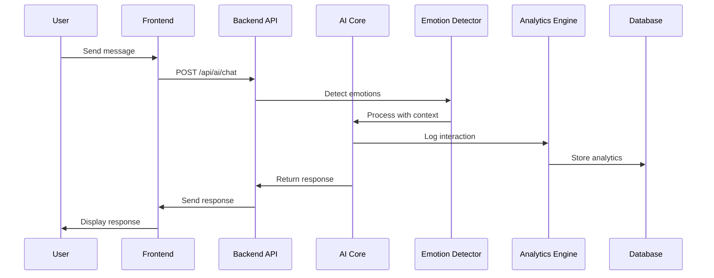

# Evolance AI Conversational System - API Implementation Guide

## Overview

The Evolance AI system integrates conversational AI with advanced emotion recognition and analytics logging to provide personalized emotional wellness guidance. This document outlines the complete implementation architecture, API endpoints, and data flow.

## Architecture Overview

```
┌─────────────────┐    ┌──────────────────┐    ┌─────────────────┐
│   Frontend      │    │   Backend API    │    │   AI Core       │
│   (React)       │◄──►│   (FastAPI)      │◄──►│   (Python)      │
└─────────────────┘    └──────────────────┘    └─────────────────┘
                              │
                              ▼
                       ┌──────────────────┐
                       │   Analytics      │
                       │   Database       │
                       │   (MongoDB)      │
                       └──────────────────┘
```

## Core Components

### 1. Hybrid AI Integration (`ai_core/hybrid_ai_integration.py`)
- **Purpose**: Main integration layer between backend API and AI systems
- **Key Features**:
  - Message processing with emotion detection
  - Crisis detection and intervention
  - Emotional profile generation
  - Avatar state management

### 2. Emotion Detector (`ai_core/emotion_detector.py`)
- **Purpose**: Advanced emotion analysis using multiple NLP techniques
- **Capabilities**:
  - Rule-based emotion detection
  - ML-based emotion classification
  - Intensity analysis
  - Body sensation detection
  - Trigger identification

### 3. Analytics Engine (`ai_core/analytics.py`)
- **Purpose**: Comprehensive analytics and insights generation
- **Features**:
  - Emotional trend analysis
  - Growth milestone tracking
  - Fulfillment scoring
  - Behavioral pattern recognition

## API Endpoints

### Authentication Endpoints

#### POST `/api/auth/register`
**Purpose**: User registration with initial emotional baseline
```json
{
  "email": "user@example.com",
  "password": "secure_password",
  "full_name": "John Doe"
}
```

**Response**:
```json
{
  "access_token": "jwt_token_here",
  "token_type": "bearer"
}
```

#### POST `/api/auth/login`
**Purpose**: User authentication
```json
{
  "email": "user@example.com",
  "password": "secure_password"
}
```

### Conversational AI Endpoints

#### POST `/api/ai/chat`
**Purpose**: Process user messages with emotion recognition and response generation

**Request**:
```json
{
  "message": "I'm feeling really anxious about my upcoming presentation",
  "context": {
    "previous_emotions": ["anxiety", "fear"],
    "session_duration": 300,
    "interaction_count": 5
  }
}
```

**Response**:
```json
{
  "response": "I can sense the anxiety you're carrying about your presentation. This is completely normal - our bodies often respond to important moments with heightened awareness. Let's explore what's behind this anxiety together. What specifically about the presentation is causing you the most concern?",
  "emotion_analysis": {
    "primary_emotion": "anxiety",
    "confidence": 0.89,
    "intensity": 0.75,
    "valence": -0.3,
    "arousal": 0.8,
    "body_sensations": ["chest_tightness", "racing_thoughts"],
    "triggers": ["public_speaking", "performance_pressure"]
  },
  "ai_insights": [
    "User shows performance anxiety patterns",
    "High arousal suggests fight-or-flight response",
    "Previous interactions show similar anxiety triggers"
  ],
  "crisis_detected": false,
  "timestamp": "2024-01-15T10:30:00Z"
}
```

#### GET `/api/ai/emotional-state`
**Purpose**: Get current emotional state and trends

**Response**:
```json
{
  "current_emotion": "anxiety",
  "emotional_trend": "increasing",
  "intensity_level": 0.75,
  "recent_emotions": [
    {"emotion": "anxiety", "timestamp": "2024-01-15T10:30:00Z", "intensity": 0.75},
    {"emotion": "fear", "timestamp": "2024-01-15T10:25:00Z", "intensity": 0.6}
  ],
  "body_sensations": ["chest_tightness", "racing_thoughts"],
  "recommended_actions": [
    "Deep breathing exercise",
    "Progressive muscle relaxation",
    "Cognitive reframing"
  ]
}
```

### Analytics Endpoints

#### GET `/api/ai/profile`
**Purpose**: Get comprehensive emotional profile and analytics

**Response**:
```json
{
  "emotional_fingerprint": {
    "anxiety": 0.35,
    "joy": 0.25,
    "sadness": 0.15,
    "anger": 0.10,
    "fear": 0.15
  },
  "fulfillment_trend": "ascending",
  "total_interactions": 150,
  "recent_emotions": ["anxiety", "joy", "anxiety", "fear", "joy"],
  "dominant_emotion": "anxiety",
  "emotional_balance_score": 65,
  "growth_milestones": [
    {
      "type": "emotional_awareness",
      "description": "Recognized anxiety triggers",
      "date": "2024-01-10T14:20:00Z",
      "confidence": 0.85
    },
    {
      "type": "coping_skills",
      "description": "Successfully used breathing techniques",
      "date": "2024-01-12T09:15:00Z",
      "confidence": 0.92
    }
  ],
  "analytics": {
    "weekly_emotion_distribution": {
      "monday": {"anxiety": 0.4, "joy": 0.3, "sadness": 0.3},
      "tuesday": {"anxiety": 0.3, "joy": 0.5, "sadness": 0.2}
    },
    "trigger_analysis": {
      "work_pressure": 0.45,
      "social_situations": 0.25,
      "health_concerns": 0.20,
      "relationship_issues": 0.10
    },
    "coping_effectiveness": {
      "breathing_exercises": 0.85,
      "meditation": 0.78,
      "physical_exercise": 0.72
    }
  }
}
```

#### GET `/api/ai/emotional-state/timeseries`
**Purpose**: Get time-series emotional data for visualization

**Response**:
```json
{
  "emotions": {
    "anxiety": [
      {"timestamp": "2024-01-15T10:00:00Z", "value": 0.3},
      {"timestamp": "2024-01-15T10:30:00Z", "value": 0.75},
      {"timestamp": "2024-01-15T11:00:00Z", "value": 0.45}
    ],
    "joy": [
      {"timestamp": "2024-01-15T10:00:00Z", "value": 0.6},
      {"timestamp": "2024-01-15T10:30:00Z", "value": 0.2},
      {"timestamp": "2024-01-15T11:00:00Z", "value": 0.4}
    ]
  },
  "summary": {
    "total_data_points": 150,
    "time_range": "7_days",
    "dominant_emotion": "anxiety",
    "trend": "fluctuating"
  }
}
```

## Data Flow Architecture

### 1. Message Processing Flow



### 2. Emotion Recognition Pipeline

```
Input Text → Preprocessing → Rule-based Detection → ML Classification → Score Combination → Intensity Analysis → Context Integration → Final Emotion Result
```

**Detailed Steps**:

1. **Text Preprocessing**
   - Remove special characters
   - Normalize text
   - Extract key phrases

2. **Rule-based Detection**
   - Keyword matching
   - Intensity indicators
   - Negation handling

3. **ML Classification**
   - Transformer-based emotion classification
   - Sentiment analysis
   - Confidence scoring

4. **Score Combination**
   - Weighted combination of rule-based and ML scores
   - Context-aware adjustments
   - Confidence thresholding

5. **Intensity Analysis**
   - Emotional intensity calculation
   - Arousal and valence mapping
   - Body sensation detection

### 3. Analytics Logging System

#### Data Collection Points

1. **Message Interactions**
   ```python
   {
     "user_id": "user_123",
     "message": "I'm feeling anxious",
     "timestamp": "2024-01-15T10:30:00Z",
     "emotion_detected": "anxiety",
     "confidence": 0.89,
     "intensity": 0.75,
     "response_generated": "I understand your anxiety...",
     "session_id": "session_456"
   }
   ```

2. **Emotional State Changes**
   ```python
   {
     "user_id": "user_123",
     "emotion_before": "neutral",
     "emotion_after": "anxiety",
     "trigger": "work_pressure",
     "duration": 300,
     "coping_mechanism_used": "breathing_exercise",
     "effectiveness": 0.85
   }
   ```

3. **Growth Milestones**
   ```python
   {
     "user_id": "user_123",
     "milestone_type": "emotional_awareness",
     "description": "Recognized anxiety patterns",
     "confidence": 0.85,
     "date": "2024-01-15T10:30:00Z",
     "supporting_evidence": ["repeated_anxiety_detection", "self_reporting"]
   }
   ```

## Implementation Details

### Emotion Detection Configuration

```python
# emotion_detector.py configuration
EMOTION_CONFIG = {
    "confidence_threshold": 0.7,
    "intensity_scale": "0-1",
    "supported_emotions": [
        "joy", "sadness", "anger", "fear", "surprise", 
        "disgust", "trust", "anticipation", "love", "optimism"
    ],
    "ml_model": "j-hartmann/emotion-english-distilroberta-base",
    "sentiment_model": "cardiffnlp/twitter-roberta-base-sentiment-latest"
}
```

### Analytics Configuration

```python
# analytics.py configuration
ANALYTICS_CONFIG = {
    "data_retention_days": 365,
    "aggregation_intervals": ["hourly", "daily", "weekly", "monthly"],
    "milestone_confidence_threshold": 0.8,
    "trend_analysis_window": 30,  # days
    "crisis_detection_enabled": True,
    "privacy_compliance": "GDPR"
}
```

### Crisis Detection System

```python
CRISIS_INDICATORS = {
    "suicidal_thoughts": [
        "want to die", "kill myself", "end it all", "no reason to live"
    ],
    "self_harm": [
        "hurt myself", "cut myself", "self harm", "self injury"
    ],
    "severe_depression": [
        "hopeless", "worthless", "can't go on", "give up"
    ],
    "panic_attack": [
        "can't breathe", "heart attack", "dying", "losing control"
    ]
}
```

## Security and Privacy

### Data Protection
- All emotional data encrypted at rest
- User consent required for analytics
- GDPR compliance implementation
- Data anonymization for research

### Access Control
- JWT-based authentication
- Role-based access control
- API rate limiting
- Audit logging

## Performance Optimization

### Caching Strategy
- Emotion detection results cached for 5 minutes
- User profiles cached for 15 minutes
- Analytics aggregated hourly

### Database Optimization
- Indexed on user_id and timestamp
- Partitioned by date for large datasets
- Read replicas for analytics queries

## Monitoring and Alerting

### Key Metrics
- API response times
- Emotion detection accuracy
- Crisis detection false positives/negatives
- User engagement rates

### Alerts
- Crisis detection triggers
- System performance degradation
- Data quality issues
- Security incidents

## Testing Strategy

### Unit Tests
- Emotion detection accuracy
- API endpoint functionality
- Data validation

### Integration Tests
- End-to-end message processing
- Analytics pipeline
- Database operations

### Performance Tests
- Load testing for concurrent users
- Memory usage optimization
- Response time benchmarks

## Deployment Considerations

### Environment Variables
```bash
# Required environment variables
OPENAI_API_KEY=your_openai_key
MONGO_URL=mongodb://localhost:27017
SECRET_KEY=your_secret_key
ENVIRONMENT=production
LOG_LEVEL=INFO
```

### Scaling Strategy
- Horizontal scaling for API servers
- Database sharding for large datasets
- CDN for static assets
- Load balancing for high availability

## Future Enhancements

### Planned Features
1. **Multimodal Emotion Detection**
   - Voice tone analysis
   - Facial expression recognition
   - Physiological data integration

2. **Advanced Analytics**
   - Predictive emotional modeling
   - Personalized intervention recommendations
   - Long-term growth trajectory analysis

3. **Integration Capabilities**
   - Wearable device integration
   - Calendar integration for context
   - Social media sentiment analysis

### Research Opportunities
- Emotion detection accuracy improvement
- Personalized response generation
- Crisis intervention effectiveness
- Long-term wellness outcomes

## Conclusion

This API implementation guide provides a comprehensive framework for building an AI-powered conversational system with advanced emotion recognition and analytics. The system is designed to be scalable, secure, and privacy-compliant while providing meaningful insights for spiritual wellness and personal growth.

For implementation questions or technical support, refer to the codebase documentation or contact the development team. 